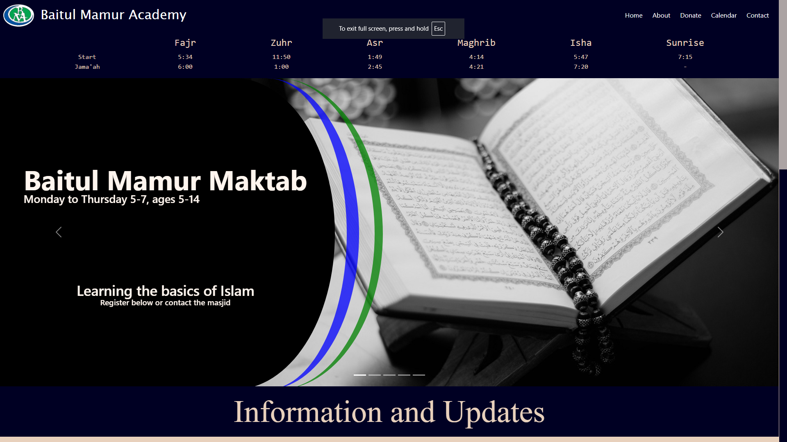

[![Portfolio][portfolio-shield]][portfolio-url]

 

  <h3 align="center">Mosque Website</h3>
  

    A website for Baitul Mamur Academy, a Mosque in east London.
  

<!-- ABOUT THE PROJECT -->

## About The Project

### Purpose of project

The projects aims to provide information to the Muslim community through the comfort of their homes. The website allows the Mosque staff to communicate information to the community enabling them to have upto date information about the Mosque. This information can include prayer times calendar, donation details, Mosque events, Mosque classes, the history of the Mosque and future plans, how to contact them and more.

This website is a personal project and is currently being used by my local Mosque.

### Built With

- [![React][React.js]][React-url]
- [![Stripe API][Stripe-api]][Stripe-url]

<!-- MARKDOWN LINKS & IMAGES -->
<!-- https://www.markdownguide.org/basic-syntax/#reference-style-links -->

[portfolio-shield]: https://img.shields.io/badge/Portfolio-000?style=for-the-badge&logo=web&logoColor=white
[portfolio-url]: https://habibabdulwahid.com/
[React.js]: https://img.shields.io/badge/React-20232A?style=for-the-badge&logo=react&logoColor=61DAFB
[React-url]: https://reactjs.org/
[Stripe-api]: https://img.shields.io/badge/Stripe-API-blue?style=for-the-badge&logo=stripe&logoColor=white
[Stripe-url]: https://stripe.com/docs/api
